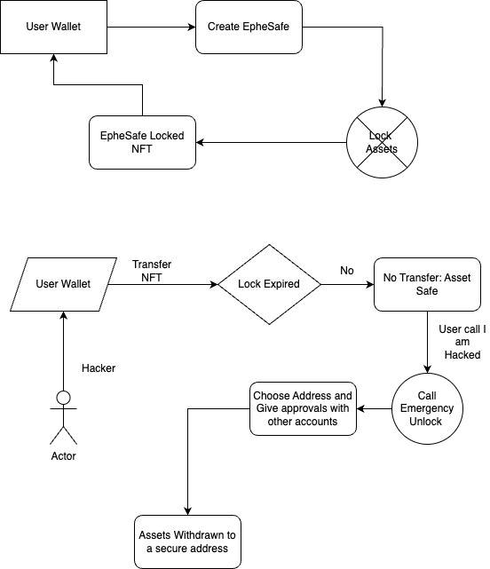

# EpheSafe

EpheSafe is a decentralized application (dApp) built on the RootStock blockchain that allows users to lock their assets into "safe" NFTs, securing them from unauthorized transfers. The assets can be claimed after a specified lock period or via an emergency unlock process using a multi-signature mechanism.

## Features

- **Safe NFTs**: Mint time-bound NFTs that represent locked assets (ETH or ERC-20 tokens).
- **Asset Locking**: Lock assets into the smart contract, ensuring they are protected until the lock expires.
- **Emergency Unlock**: If a wallet is compromised, initiate an emergency unlock that requires multiple approvals.
- **Multi-Signature Security**: Set multiple addresses for approving emergency unlocks to protect against single points of failure.
- **Claim Assets**: Claim locked assets once the lock period expires or upon successful emergency unlock.

## How It Works

### Safe Creation
1. The user selects the assets (ETH or ERC-20 tokens) and specifies the amount.
2. A lock period (expiry) is defined by the user.
3. The user sets up a multi-signature approval mechanism, specifying the number of approvals required and the addresses authorized to approve the emergency unlock.
4. A "Safe NFT" is minted and transferred to the user’s wallet. The locked assets are stored in the contract until the lock expires or an emergency unlock is triggered.

### Emergency Unlock
1. If a wallet is compromised, the user can initiate an emergency unlock.
2. Approval is required from a pre-defined set of multi-signature addresses.
3. Once enough approvals are collected, the assets are transferred to a secure address provided by the user.

### Claiming Assets
1. Once the lock period expires, the user can claim their assets back into their wallet.
2. The Safe NFT is burned upon successful claiming.

## Smart Contract Architecture

- **EpheSafe Smart Contract**: The core smart contract responsible for minting, locking, unlocking, and claiming assets.
- **Multi-Signature Mechanism**: Users can configure multiple approval addresses to authorize emergency unlocks.
- **ERC-20 Integration**: Support for locking ERC-20 tokens as well as native Ethereum (ETH).

### Contract Logic

1. **Minting a Safe NFT**: 
    - The user mints a Safe NFT representing the locked assets and the expiry time.
    - Assets are locked into the contract, and the NFT is sent to the user’s wallet.

2. **Emergency Unlock**: 
    - If a wallet is compromised, the emergency unlock can be triggered.
    - Requires multiple signatures from designated addresses to approve the unlock.

3. **Claiming Assets**:
    - When the lock period expires, the user can claim the locked assets by burning the Safe NFT.
  

## Video Demo

## Smart Contracts

Token Treat Contract : https://explorer.testnet.rootstock.io/address/0xf6b29cf96471e9bfbbb52623395759ca948f4554

## TryOut Link

https://ephesafe.vercel.app